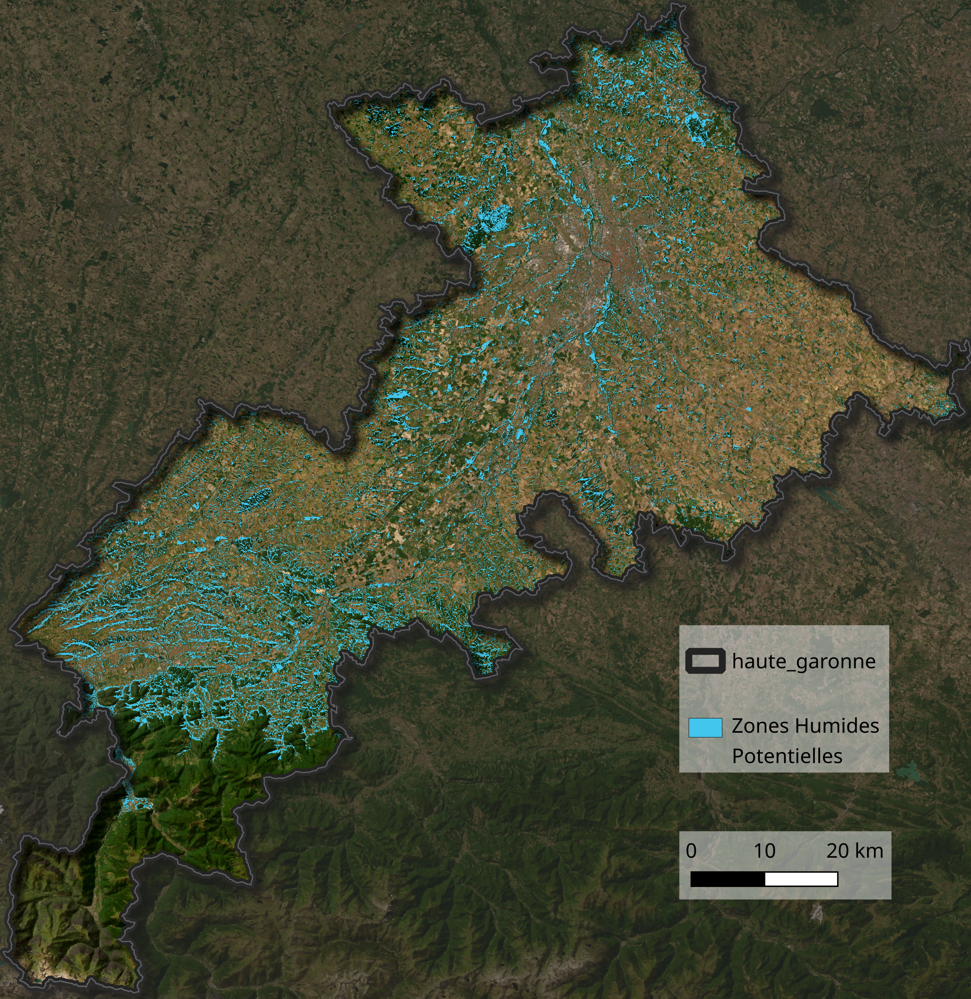

# Stage Cartographie des zones humides potentielles par random forest à partir d'images satellitaires
L’inventoriage des zones humides sur le terrain est un processus long et coûteux. Il en résulte que les
inventaires sont inégalement disponibles selon les régions et souvent datés. Il existe une Cartographie Nationale des Zones Humides (CNZH), réalisée par l’institut PatriNat, issue d’une classification
par random forest à partir de variables hydrologiques, topographiques et géologiques. Cependant, le choix
de ces variables ne permet pas de suivi inter-annuel, ni de détection des zones humides artificialisées ou
drainées.  

La <a href="https://www.cerema.fr/fr/actualites/reauzoh-intelligence-artificielle-au-service-cartographie">méthode REAUZOH</a>, développée par le Cerema, pallie ces limites par l’intégration d’images satellites optiques (Sentinel-2) et SAR (Sentinel-1). Cette méthode nécessite toutefois un jeu de vérité terrain réalisé in situ par des experts, ce qui en limite la reproductibilité. Elle a également été mise au point sur une communauté de commune de petite superficie.  

Nous avons adapté cette méthode au département de la Haute-Garonne et à l’absence de jeu de vérité
terrain ad hoc. Nos contributions principales à cette méthode sont : (i) modification de la méthode de
constitution du jeu de données, en utilisant un inventaire publique et en constituant un jeu de vérité
terrain négatif à partir de la CNZH ; (ii) affinage du jeu de données positif pour tenir compte de la variabilité saisonnière des zones humides ; (iii) implémentation d’une étape d’extraction des caractéristiques
des variables d’entrée par Analyse en Composante Principale ; (iv) amélioration de l’optimisation des
hyperparamètres du random forest par l’algorithme Tree-Structured Parzen Estimator. Notre méthode
montre de bons résultats sur le jeu de données global (f1-score moyen de 84%, ROC-AUC de 0.93) mais
sur-évalue la présence de zones humides dans les zones boisées (rappel de 64% des non zones humides de
fort NDVI).  

Nous présentons également une étude de l’apport marginal à cette méthode des produits de température de surface (TS) Landsat et ECOSTRESS et des images du satellite NISAR (images SAR de bande L
en polarisation horizontale). Nous avons extrait des médianes saisonnières des TS des satellites Landsat
et une image d’amplitude thermique journalière des TS du capteur ECOSTRESS. Nous avons utilisé les
images NISAR de rétrodiffusion et de cohérence de phase entre deux acquisitions. Notre étude ne montre
pas d’amélioration significative de la classification en ajoutant les images de TS (f1-score moyen de 81.4
± 0.1% contre 81.4 ± 0.2% pour la méthode témoin) et une légère amélioration en ajoutant les images
NISAR (f1-score moyen de 79.7 ± 0.2% contre 79.3 ± 0.2% pour la méthode témoin).  

Pour un rapport méthodologique détaillé de ce stage, voir le fichier [rapport_methodologique.pdf](rapport_methodologique.pdf) de ce dépôt.  

<p align="center">
  
  <br>
  <em>Carte des zones humides potentielles de Haute-Garonne</em>
</p>

## Structure du dépôt
```text
.
├───lib        # contient shreklib.py qui inclue des fonctions mineures utilisées dans différents scripts
├───pipeline        # dossier contenant les scripts .py de la chaîne de production de la cartographie des zones humides potentielles
└───pre_traitement_donnees      # dossier contenant des jupyter notebooks utilisés pour le pré-traitement des images fournies en entrée du modèle
   ├───LST_landsat
   ├───S1
   └───topo
```
  
# Installation
le fichier /requirements.txt contient les librairies python utilisée pour le développement des scripts python de ce dépôt.  
  
# Utilisation
Le dossier /pipeline contient les scripts du modèle au format .py, directement utilisables.  
Les scripts .py y sont numérotés dans l'ordre nécessaire à leur utilisation pour la reproduction de la méthode.  
  
## script 0_bdtopo_mask.sql
Ce script est à exécuter sur une base de données PGSQL incluant les couches de la BD TOPO de l'IGN qui sont mentionnées dans les requêtes. Ce script permet de créer une couche pgsql bdtopo_mask qui est utilisée par le script 1_create_datasets.py

## script 1_create_datasets.py 
Ce script crée le jeu de données de référence. 

### entrée
Il prend en entrée le chemin vers un fichier de configuration .yaml. Le format d'un tel fichier et la signification des différents éléments à y spécifier est détaillé dans le fichier d'exemple 1_create_datasets.yaml.

### sorties
Ce script exporte, dans le dossier paramétré dans le fichier de configuration, deux dataframe pandas correspondant au jeu de données de référence des individus labellisés zones humides et à celui des individus labellisés non zones humides.

### exécution
Pour exécuter ce fichier, il faut se placer dans un environnement python vérifiant les dépendances nécessaires (cf requirements.txt) et dans le dossier /pipeline dans un terminal de commande et exécuter :  
python 1_create_datasets.py /chemin/du/fichier/de/config.yaml

## script 2_training.py
Ce script entraîne le modèle de cartographie des zones humides à partir du jeu de référence issus du script 1_create_datasets.py.

### entrées
entrées nécessaires :
- seed (entier): graine pour fixer la rng du script
- out_folder (str): dossier d'export des sorties
- zh_indivs_fp (str): chemin du fichier zh_indivs.pkl exporté par 1_create_datasets.py
- znh_indivs_fp (str): chemin du fichier znh_indivs.pkl exporté par 1_create_datasets.py

entrées optionnelles : 
- zh_group_col (str): nom de la colonne du dataframe des individus zones humides utilisé pour la gestion de l'auto-corrélation spatiale (défaut : "nom")
- znh_autocorrel_grid_size (entier): taille des carreaux utilisés pour la gestion de l'auto-corrélation spatiale des non zones humides en nombre de pixels (défaut : 500)
- train_test_frac (float): fraction entre 0 et 1 de la division entre jeu d'entraînement et jeu de test (défaut : 0.75)
- optim_n_trials (entier): nombre d'itérations de l'optimisation des hyperparams (défaut : 15)
- season_filter_graphic (bool): export optionnel de l'histogramme du pourcentage de chaque mois conservé pour l'entraînement du modèle (défaut : False)
- roc_curve (bool): export optionnel de la courbe ROC du jeu de test, avec AUC et valeur des seuils optimaux précisés dessus (défaut : False)
- model_analysis (bool): export de
   - graphique des importances par permutation et informations mutuelles de chaque CP
   - tableau latex des variables les plus corrélées avec chaque CP
   - visualisation de la relation entre chaque CP et la probabilité d'être une zone humide selon le modèle
   (défaut : False)

### sorties
- model.pkl : dictionnaire des paramètres du modèle
les attributs de ce dictionnaire sont:
    - rf : objet sklearn.ensemble.RandomForestClassifier entraîné
    - column_orders : ordre des colonnes pour formatter les dataframes sur lesquels appliquer le modèle
    - pca : objet sklearn.decomposition.PCA contenant les coordonnées des composantes principales, calculées sur le jeu d'entraînement, retenues
    - proba_seuil_optim : seuil minimal de probabilité d'être une zone humide selon rf pour classer un individu en zone humide
    - scalers : dictionnaire d'objets /lib/shreklib/torchScaler contenant les moyennes et écart-types calculés sur le jeu d'entraînement pour le centrage et réduction des variables
    - to_keep : indices des lignes du df zh_indivs.pkl retenues pour l'entraînement du modèle
- matrice_de_confusion.csv : matrice de confusion du jeu de test par classe majoritaire (pas pour chaque individu mensuel mais pour chaque pixel)
- metriques.csv : précision, rappel et f1_score de chaque classe
- train_dataset.pkl : jeu d'entraînement avec trois plis pour validation croisée (colonne "pli" du dataframe)
- test_dataset.pkl : jeu de test

### exécution
Pour exécuter ce fichier, il faut se placer dans un environnement python vérifiant les dépendances nécessaires (cf requirements.txt) et dans le dossier /pipeline dans un terminal de commande et exécuter :  
python 2_training.py seed dossier/de/sortie dossier/modele/zh_indivs.pkl dossier/modele/znh_indivs.pkl --nom --500 --0.75 --15 --False --False --False

## 3_inference.py
Ce script exporte la cartographie des zones humides potentielles à partir des images fournies en entrée et du modèle issu de 2_training.py

### entrée
Il prend en entrée le chemin vers un fichier de configuration .yaml. Le format d'un tel fichier et la signification des différents éléments à y spécifier est détaillé dans le fichier d'exemple 3_inference.yaml.

### sorties :
- carte_zones_humides_potentielles.tif : geotiff de la cartographie des zones humides potentielles
- probabilites_mensuelles.tif : geotiff des probabilités pour chacun des mois fournis en entrée. Les probabilités sont quantifiées sur les entiers de 0 à 254. 255 est réservé aux nodata.

### exécution :
Pour exécuter ce fichier, il faut se placer dans un environnement python vérifiant les dépendances nécessaires (cf requirements.txt) et dans le dossier /pipeline dans un terminal de commande et exécuter :  
python 3_inference.py /chemin/du/fichier/de/config.yaml